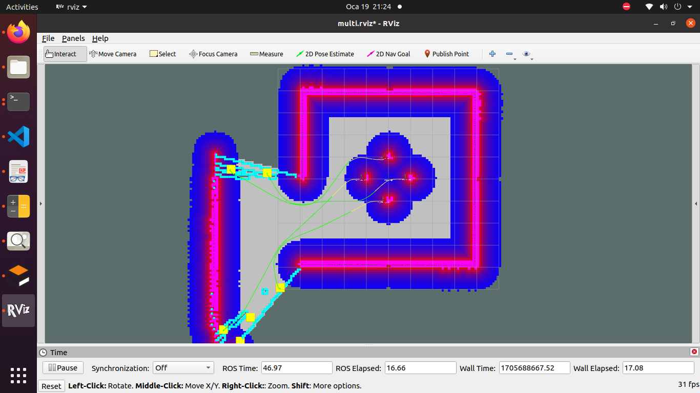
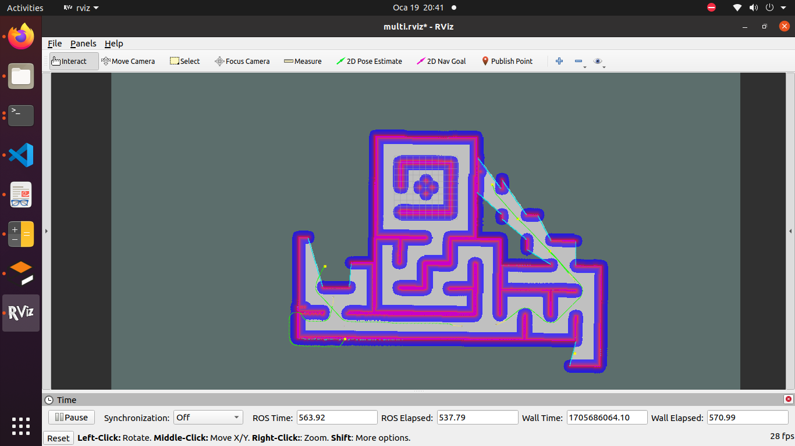
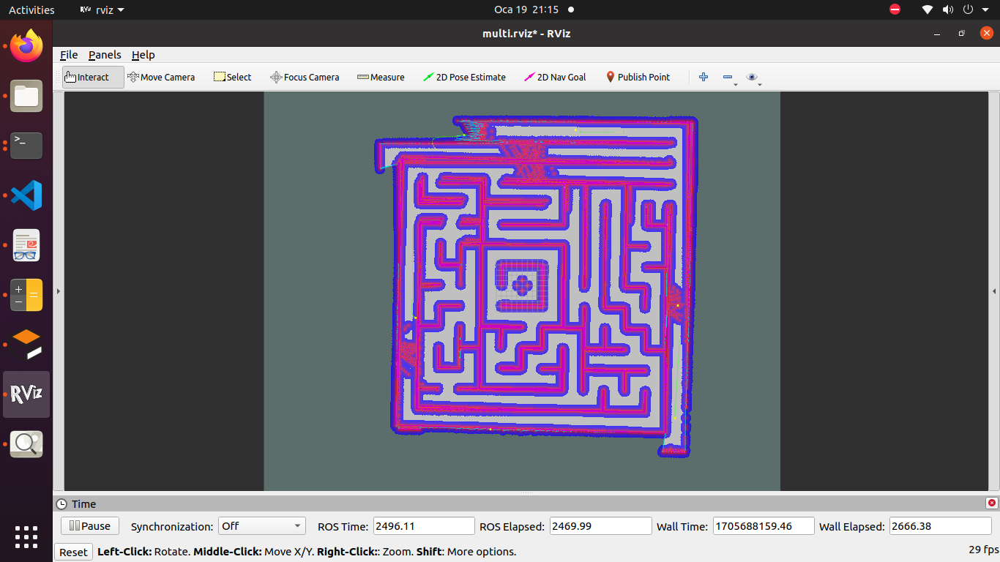

# Frontier-Based Map Exploration

### Prerequisite ROS Packages
```
  actionlib_msgs
  geometry_msgs
  interactive_markers
  message_generation
  nav_msgs
  roscpp
  rospy
  sensor_msgs
  std_msgs
  turtlebot3_msgs
  visualization_msgs

```

## Build
```
catkin_make
source devel/setup.bash
```

## Run
```
rosrun explore_map explorer_manager_node 
```


# Algorithm

When initializing a node, four MoveBaseClients are created for each robot, and the algorithm waits for these services to become active. Once the Action Services are active, the algorithm operates through callback triggering. The grid map is obtained using the 'gridMapCallback()' function. Each index in the grid map is traversed, and a check is made whether that point is a frontier point or not (using the 'isFrontierCell()' function). If it is a frontier point, those points are added to a vector named 'frontierPoints.'

Frontier points are clustered using the K-Means algorithm, resulting in a total of 6 frontier centers identified on the map. The map is divided into four slices with 90-degree angles from the center, and each robot is responsible for one of these slices. Frontier points are queried for each slice, and the corresponding region's target point is assigned as the 'm_region1_centroids' variable for the 1st region.

If there is no target point for that region, the robot randomly selects at least two unassigned points to assist the algorithm in reaching those points. The assigned target points are then removed from the vectors

```cpp
if (!m_region1_centroids.empty())
        {
            goal_pose.target_pose.pose.position.x = m_region1_centroids.front().x;
            goal_pose.target_pose.pose.position.y = m_region1_centroids.front().y;
            goal_pose.target_pose.pose.orientation.w = 1.0;
            sendGoalForRobot1(goal_pose);
            ROS_INFO("Goal Sent For Robot 1");
        }
        else
        {
            goal_pose.target_pose.pose.position.x = centroids.front().x;
            goal_pose.target_pose.pose.position.y = centroids.front().y;
            goal_pose.target_pose.pose.orientation.w = 1.0;
            centroids.erase(std::find(centroids.begin(), centroids.end(), centroids.front()));
            sendGoalForRobot1(goal_pose);
            ROS_INFO("Goal Sent From Other Territory Robot 1 ");
        }
```


###### Video: 
[](http://www.youtube.com/watch?v=WLGIg5bvUiQ)

###### Pictures: 



